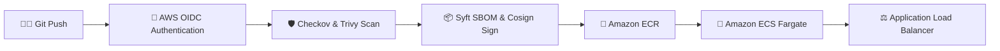

# 🔐 VaultForge — DevSecOps Platform & Container Delivery

[](https://aws.amazon.com/ecs/)
[](https://www.terraform.io/)
[](https://github.com/features/actions)
[](https://github.com/sanmathik8/VaultForge)

A reference **DevSecOps platform** securing containerized workloads on **Amazon ECS Fargate** without static AWS access credentials.

---

## 🎯 Architectural Overview

VaultForge automates container security, supply-chain verification, and cloud deployment. It uses **OpenID Connect (OIDC)** identity federation to authenticate with AWS STS dynamically, runs pre-build IaC scans with **Checkov**, checks container CVEs with **Trivy**, generates CycloneDX SBOMs with **Syft**, keylessly signs container images with **Cosign**, and deploys non-root containers to Amazon ECS Fargate.



---

## ⚡ Key Engineering Features

- **🔐 Passwordless OIDC Identity:** Eliminates static `AWS_ACCESS_KEY_ID` secrets by exchanging short-lived GitHub OIDC tokens with AWS STS.
- **🛡️ Hardened Task Context:** ECS task definitions execute as a non-root user (`user: 10001:10001`) with read-only root filesystems (`readonlyRootFilesystem: true`) and in-memory `/tmp` mounts.
- **📦 Keyless Image Signing:** Verifies container image authenticity with Cosign keyless Sigstore signatures using OIDC identity tokens.
- **🏗️ Modular Terraform Infrastructure:** Declaratively provisions IAM OIDC roles, Amazon ECR repositories, and ECS Fargate clusters.
- **🚀 Reusable CI/CD Workflows:** Modular pipeline architecture separating security (`security.yml`), build (`build.yml`), deploy (`deploy.yml`), and validation (`validate.yml`).

---

## 🛠️ Technology Stack

- **Cloud Services:** AWS ECS Fargate, Amazon ECR, Application Load Balancer (ALB), IAM OIDC, CloudWatch, S3 State Backend
- **Infrastructure as Code:** Terraform 1.14+, Modular HCL
- **Security Tools:** Checkov, Trivy, Cosign, Syft, Gitleaks, Hadolint
- **Languages & Frameworks:** Python, Docker, YAML, Bash

---

## 🚀 Quickstart & Usage

### 1. Provision AWS Infrastructure
```bash
cd terraform/bootstrap
terraform init
terraform apply
```

### 2. Trigger Automated CI/CD Pipeline
Push any change to `main` branch to trigger `.github/workflows/pipeline.yml`:
```bash
git add .
git commit -m "Deploy hardened workload"
git push origin main
```

---

## 📄 License
Distributed under the MIT License.
