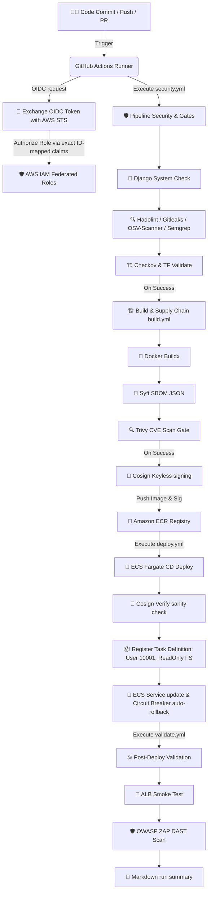

# 🔐 VaultForge — Enterprise DevSecOps & Fargate Resiliency Platform

VaultForge is a reference DevSecOps platform designed to secure, build, sign, and deploy containerized Python applications to AWS ECS Fargate. The platform replaces all static credentials with passwordless OIDC authentication, enforces multi-layered container security gates, cryptographically signs container supply chains, and deploys to a hardened, non-root, read-only Fargate container cluster with automated rollbacks.

> [!NOTE]
> **Demo Design Disclaimer:** This project uses an ephemeral SQLite database stored at `/tmp/db.sqlite3` on a local memory volume to avoid cloud RDS costs. It is not multi-instance safe. Additionally, the workload is an intentionally vulnerable OWASP PyGoat instance designed to be flagged by the security scanning stages.

---

## 📌 Problem Statement & Solution

### The Security Problems
1. **Credentials Exposure:** Static `AWS_ACCESS_KEY_ID` secrets saved in CI/CD variables are vulnerable to leakage or logs exposure, granting permanent access to cloud resources.
2. **Untrusted Container Supply Chains:** Container images pulled by production clusters are vulnerable to man-in-the-middle attacks or tag tampering if they lack cryptographic signatures verifying their source.
3. **Over-Privileged Runtimes:** Standard container tasks run as the `root` user on writable root filesystems, allowing exploited workloads to write malicious binaries, execute rootkits, or escalate host privileges.

### The VaultForge Solution
- **Zero Static Credentials:** Swaps static AWS access keys for passwordless **OpenID Connect (OIDC)** STS session tokens scoped strictly to exact GitHub database IDs.
- **Automated Correctness & Security Gates:** Validates application config with Django deployment checks before running security gates—Gitleaks (secrets), Hadolint (Docker), OSV-Scanner (SCA), Semgrep (SAST), and Checkov (IaC).
- **Strict Supply-Chain Verification:** Ephemeral OIDC credentials keylessly sign images with **Cosign**, which are verified in-cluster against a repository-specific identity regex before deployment.
- **Hardened Fargate Runtime:** Enforces container execution under user `10001`, mounts a read-only root filesystem, restricts outbound network egress to HTTPS/DNS, and automatically rolls back failed releases.

---

## 📐 System Architecture



---

## 🛡️ Implemented Security Controls

### 1. Hardened IAM & OIDC Trust Scoping
- **OIDC Sub-claim Lockout:** The OIDC IAM trust policy in [`terraform/modules/oidc/main.tf`](terraform/modules/oidc/main.tf) restricts access specifically to the repository's unique GitHub user ID (`180301003`) and repository ID (`1319752793`) to prevent account-wide wildcard hijackings:
  - `repo:sanmathik8@180301003/Vaultforge_cloud@1319752793:*`
- **SSM/OIDC Audience Constraint:** Validates the token's audience parameter directly using the standard `sts.amazonaws.com` parameter value.
- **IAM PassRole Restriction:** Restricts the deployment role to pass only the specific execution and task roles needed by the application (`vault-forge-ecs-execution-role` and `vault-forge-ecs-task-role`), eliminating wildcard `Resource = "*"` escalation paths.

### 2. Supply-Chain Cryptography (Cosign)
- **Keyless Signature Generation:** signs the image digest using ephemeral OIDC tokens generated on the GitHub runner.
- **Repository-Scoped Verification:** During the CD phase in [`.github/workflows/deploy.yml`](.github/workflows/deploy.yml), Cosign verifies the signature against the specific repository identity using `--certificate-identity-regexp "https://github.com/sanmathik8/Vaultforge_cloud/.*"` rather than a broad wildcard `.*` expression.

### 3. Fargate Container Hardening
- **ReadOnly Root Filesystem:** Configured as `readonlyRootFilesystem = true` in both [`terraform/modules/ecs_fargate/main.tf`](terraform/modules/ecs_fargate/main.tf) and [`ecs/task-definition.json`](ecs/task-definition.json), preventing any runtime alterations to system binaries.
- **Non-Root Task User:** Set to `USER 10001` in [`app/Dockerfile`](app/Dockerfile) and `"user": "10001"` in [`ecs/task-definition.json`](ecs/task-definition.json) to eliminate container root shell execution.
- **Restricted Outbound Network Egress:** The task security group in [`terraform/modules/ecs_fargate/main.tf`](terraform/modules/ecs_fargate/main.tf) blocks all outgoing traffic except for:
  - **Port 443 (TCP):** Allows HTTPS outbound requests to pull ECR images and contact AWS API endpoints.
  - **Port 53 (TCP/UDP):** Allows outbound DNS name resolution.

### 4. Deployment Resiliency & Fail-Fast Gates
- **Automatic Service Rollback:** Employs Fargate's native `deployment_circuit_breaker { rollback = true }` in [`terraform/modules/ecs_fargate/main.tf`](terraform/modules/ecs_fargate/main.tf). If a container fails its health checks during deployment, Fargate automatically rolls back the service to the previous stable task definition.
- **Early Configuration Gating:** Automatically executes Django's deploy-readiness check (`python manage.py check --deploy`) in [`.github/workflows/security.yml`](.github/workflows/security.yml) prior to spinning up security scanning tools or build runners.
- **Hard Secret Failures:** Eliminates silent configuration skips; the pipeline hard-fails immediately if `AWS_ROLE_TO_ASSUME` is not defined.

---

## 🚀 How to Run & Deploy

### 1. Provision AWS Cloud Infrastructure
Navigate to the Terraform bootstrap directory on your local terminal and execute the deploy using your local administrator CLI credentials:
```bash
cd terraform/bootstrap
terraform init
terraform apply -auto-approve
```

### 2. Configure GitHub Secrets
Create the following repository secrets in your GitHub repository:
- `AWS_ROLE_TO_ASSUME`: The ARN of the ECR push role (`vault-forge-ci-ecr-push`)
- `AWS_TERRAFORM_ROLE_ARN`: The ARN of the Terraform Bootstrap role (`vault-forge-terraform-bootstrap`)

### 3. Push to Trigger Pipeline
Commit any changes and push them to the `main` branch to trigger the DevSecOps orchestrator pipeline:
```bash
git add .
git commit -m "ci: Deploy hardened DevSecOps workload"
git push origin main
```
