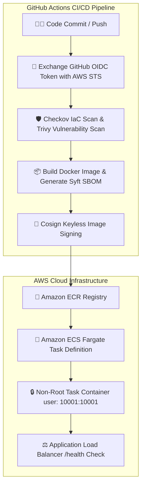

# 🔐 VaultForge — Enterprise DevSecOps & Container Security Platform

[](https://aws.amazon.com/ecs/)
[](https://www.terraform.io/)
[](https://github.com/features/actions)
[](https://github.com/sanmathik8/VaultForge)

---

## 📌 Executive Summary & Problem Statement

### The Problem
In modern cloud deployments, container build pipelines frequently suffer from critical security vulnerabilities:
1. **Leaked Credentials:** CI/CD runners often use long-lived `AWS_ACCESS_KEY_ID` and `AWS_SECRET_ACCESS_KEY` environment variables. If a pipeline log or runner is compromised, attackers gain permanent access to cloud infrastructure.
2. **Unverified Container Images:** Production clusters often pull container images without cryptographic signatures, making them vulnerable to supply-chain tampering.
3. **Over-Privileged Execution:** Container workloads frequently run as `root` with writable root filesystems, allowing malware to modify binary files or escalate privileges.

### The VaultForge Solution
VaultForge is a reference **DevSecOps infrastructure platform** that secures containerized workloads from code commit to Amazon ECS Fargate runtime:
- **Zero Static Credentials:** Authenticates to AWS via passwordless **OpenID Connect (OIDC)** token exchange.
- **Automated Security Gates:** Scans Infrastructure as Code with **Checkov**, checks container vulnerability CVEs with **Trivy**, and generates CycloneDX Software Bill of Materials (SBOMs) with **Syft**.
- **Cryptographic Supply-Chain Verification:** Signs container images keylessly with **Cosign** (Sigstore) using ephemeral OIDC tokens.
- **Runtime Hardening:** Deploys tasks to **Amazon ECS Fargate** as non-root users (`user: 10001:10001`) with read-only root filesystems (`readonlyRootFilesystem: true`).

---

## 📐 System Architecture



---

## 🔍 Step-by-Step Technical Workflow

1. **Passwordless Authentication:** The GitHub Actions runner requests a short-lived JSON Web Token (JWT) from GitHub's OIDC provider and exchanges it with **AWS Security Token Service (STS)** for a 1-hour session token (`aws-actions/configure-aws-credentials`).
2. **Infrastructure Security Gate:** Before building assets, **Checkov** parses all `.tf` files in `terraform/` to block any security misconfigurations (e.g., open security groups or unencrypted S3 buckets).
3. **Container CVE & SBOM Inspection:** **Trivy** scans the build context for high/critical vulnerabilities. **Syft** generates a CycloneDX SBOM detailing all dependencies.
4. **Keyless Sigstore Signing:** **Cosign** signs the image digest using GitHub OIDC identity. The cryptographic signature is uploaded to **Amazon ECR** alongside the container image.
5. **Hardened ECS Task Deployment:** The workflow updates the ECS service definition. Tasks start on **Amazon ECS Fargate** using a restricted security context:
   - Non-root user ID: `10001:10001`
   - Read-only root filesystem: `readonlyRootFilesystem: true`
   - Scratch memory: In-memory `emptyDir` mount at `/tmp` for temporary files.
6. **Health Validation:** The pipeline waits for the **Application Load Balancer (ALB)** to report target group health checks (`GET /health` returning `HTTP 200 OK`).

---

## 📂 Repository Directory Structure

```text
VaultForge/
├── .github/
│   └── workflows/
│       ├── pipeline.yml            # Main CI/CD Orchestrator Workflow
│       ├── security.yml            # Checkov IaC & Trivy Vulnerability Scan
│       ├── build.yml               # Docker Build, Syft SBOM & Cosign Signing
│       ├── deploy.yml              # ECS Fargate Deployment Workflow
│       ├── validate.yml            # ALB Health Check Validation
│       └── infra-bootstrap.yml     # Infrastructure Bootstrap Pipeline
├── ecs/
│   └── task-definition.json        # Hardened Non-Root ECS Task Specification
├── terraform/
│   ├── main.tf                     # Main Infrastructure Definition
│   ├── variables.tf                # Environment Variables
│   ├── outputs.tf                  # Infrastructure Endpoints & ECR URIs
│   └── modules/
│       ├── oidc/                   # IAM OpenID Connect Provider & Roles
│       ├── ecr/                    # Amazon ECR Repository Definition
│       └── ecs_fargate/            # ECS Cluster, Task & ALB Definitions
├── app/                            # Sample Workload Application
│   ├── app.py                      # Flask Application Server
│   └── Dockerfile                  # Multi-Stage Hardened Dockerfile
├── scripts/
│   └── smoke-test.sh               # Post-Deployment Endpoint Health Verification
└── README.md                       # Comprehensive Project Documentation
```

---

## 🛠️ Technology Stack Breakdown

- **Cloud Infrastructure:** AWS ECS Fargate, Amazon ECR, Application Load Balancer (ALB), IAM OIDC, Amazon CloudWatch
- **Infrastructure as Code:** Terraform 1.14+, Modular HCL Architecture
- **Security & Compliance:** Checkov, Trivy, Cosign (Sigstore), Syft (CycloneDX), Gitleaks, Hadolint
- **DevOps & Automation:** GitHub Actions, Docker, Bash

---

## 🚀 How to Run & Deploy Locally

### Prerequisites
- AWS CLI configured with administrator access
- Terraform 1.14+
- Docker Desktop installed

### 1. Provision AWS Cloud Infrastructure
```bash
cd terraform/bootstrap
terraform init
terraform plan
terraform apply -auto-approve
```

### 2. Trigger the Automated DevSecOps Pipeline
Simply commit and push any change to the repository. GitHub Actions will handle security scanning, signing, and deployment automatically:
```bash
git add .
git commit -m "feat: Deploy hardened ECS workload"
git push origin main
```

---

## 📄 License
Distributed under the MIT License. See `LICENSE` for details.
